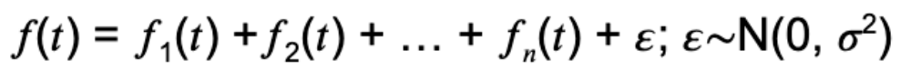
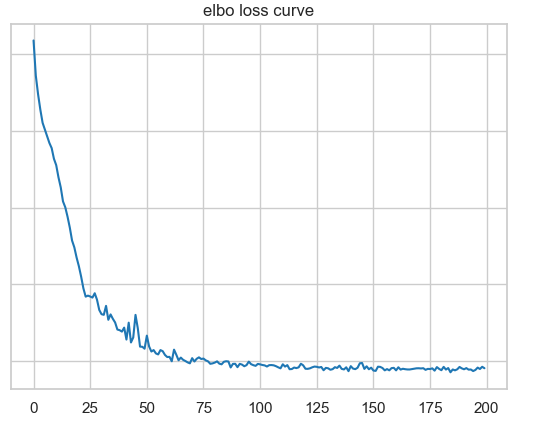
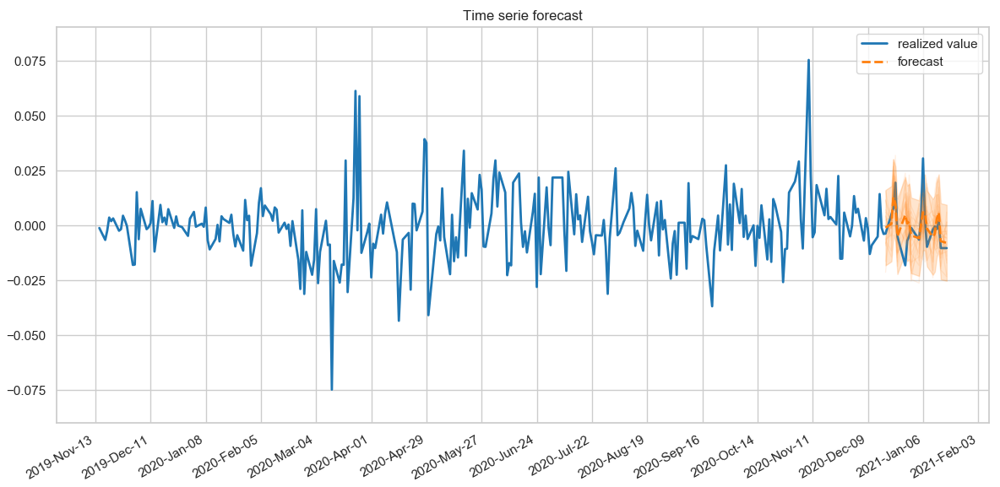
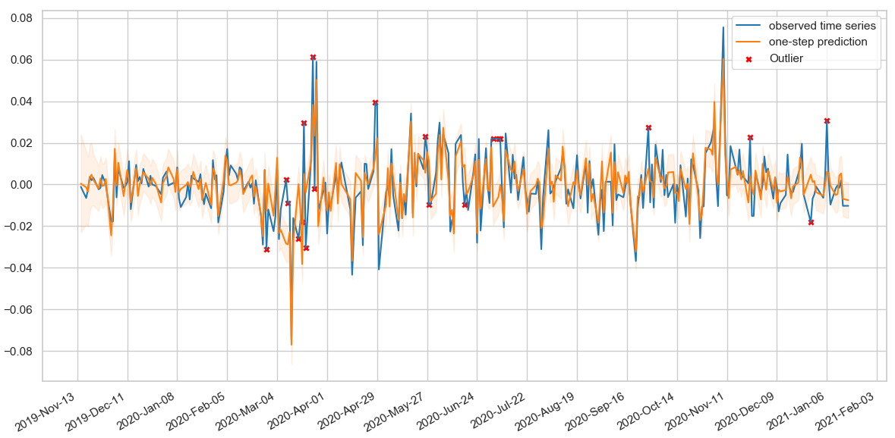

## Project DQ_STS
Data quality &amp; Forecasting for structural time-series.

## Dependencies
pip install --upgrade tensorflow

pip install --upgrade tensorflow-probability

## Motivation
Modelling structural time-series through bayesian neural nets.

A structural time-serie is expressed as:

## Use case
In the example below the daily returns of a european sectorial ETF are expressed as a function of:
*Daily returns of the Stoxx50
*Seasonality term: day of week effect
*Auto-regressive term of 1st order

### Loss function

### 20 days daily returns forecast

### Outliers identification; i.e. abs(z score) >1.96

## Credit
This code follows a similar logic to that outlined in the Structural Time Series modeling in TensorFlow Probability tutorial (Copyright 2019 The TensorFlow Authors).
